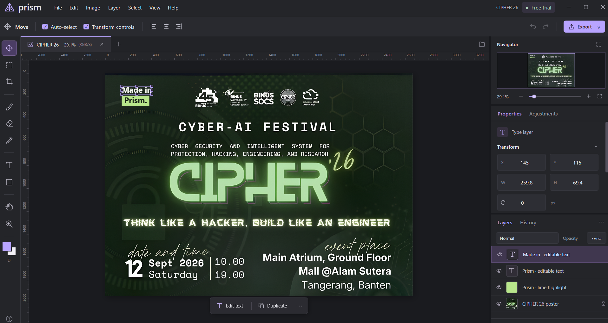
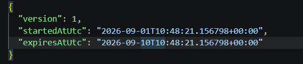
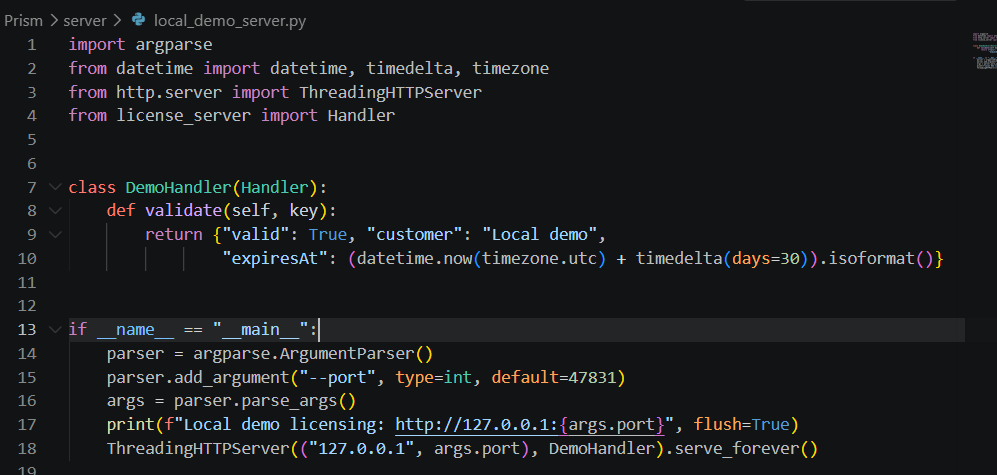
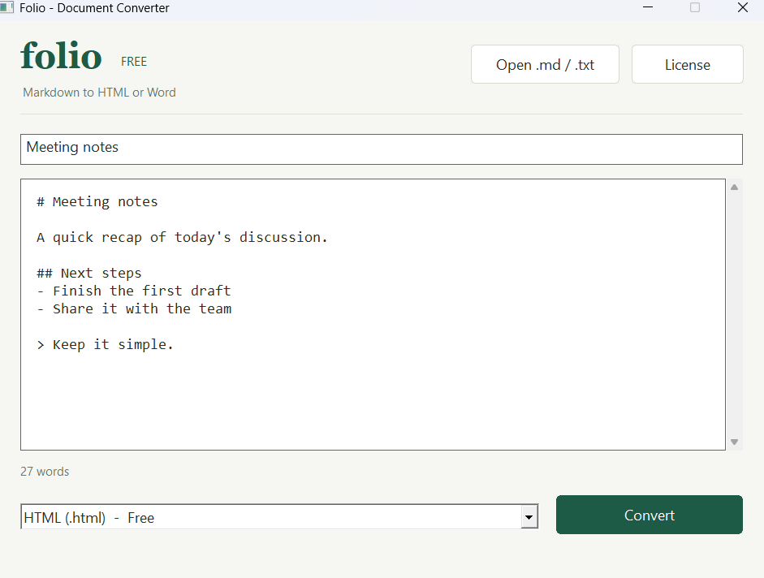
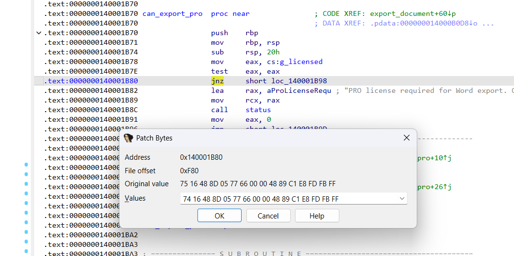
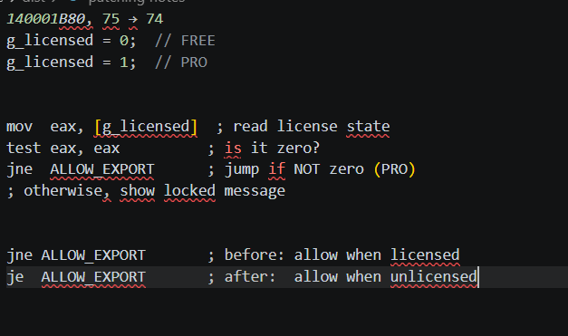
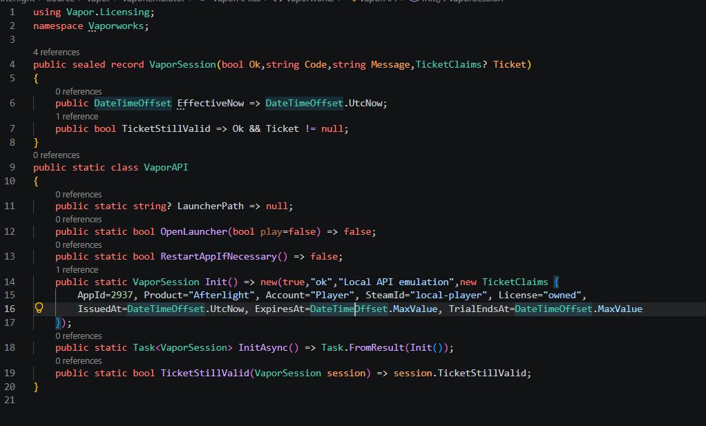

# App Cracking Demo Lab

This repository contains three original Windows applications built for a controlled exhibition about license enforcement. The demos show where a client trusts local state, a server response, a branch in its own executable, or a replaceable SDK. They are for the included apps only; they do not target Steam, Adobe, Windows, or third-party software.

The repository is intentionally split into two top-level folders:

| Folder | Purpose |
| --- | --- |
| `src/` | Source code, tests, documentation, screenshots, and build scripts |
| `final-dist/` | Local release packages produced from the source |

`final-dist/` contains the current release packages so the demo can be run immediately. Build it again from source with the command below whenever the applications change.

## The four demos

### 1. Prism — extend the local trial date

Start `final-dist/Prism/Prism.exe` once, close it, and open `%LOCALAPPDATA%\Prism\Config\trial.json`.

Change `expiresAtUtc` to a future ISO-8601 timestamp, for example `2030-09-22T00:00:00+00:00`. Reopen Prism and editing becomes available again. The app rereads this unsigned local date at its editing gate. Deleting the file also demonstrates the fresh-trial bug.





The complete explanation is in [the Prism trial note](src/Prism/docs/trial-demo.md). This is deliberately vulnerable demo code, not a production licensing design.

### 2. Prism — replace the local licensing authority

In one PowerShell window, start the loopback demo server:

```powershell
python src/Prism/server/local_demo_server.py
```

Edit `%LOCALAPPDATA%\Prism\Config\licensing.json` so it contains:

```json
{"serverUrl":"http://127.0.0.1:47831"}
```

Restart Prism, enter any nonempty key, and activate. The local server accepts it and returns a 30-day demo entitlement. The strict server keeps rejecting unknown keys; this works because the client lets its server URL be changed and accepts an unsigned JSON response.



Read [the server protocol](src/Prism/server/README.md) for the VPS/localhost distinction. Keep the local server bound to loopback.

### 3. Folio — invert one executable branch

Open `final-dist/Folio/PatchMe.exe` while it says `FREE`. Choose Word/RTF export; it should be locked. Work on a copy of the executable in a lab folder, then locate `can_export_pro` in IDA or HxD. The supplied build is verified by:

```powershell
python src/PatchMe/scripts/verify.py
```

In the verified build, the gate is at file offset `0xF80` and begins `75 16`. Change only `75` to `74` (`JNE` to `JE`) in the copy. Run the copy, export a real `.rtf`, and inspect the file. The FREE badge may remain unchanged; the output is the proof.







`75 -> 74` inverts the check for the supplied build. `75 -> EB` is the unconditional-allow variant. Offsets are build-specific, so derive the current site instead of guessing.

### 4. Afterlight — replace the verifier SDK manually

This is a file-level exercise for the source-owned lab package. Work on a disposable copy; this walkthrough does not require launching the demo app or presenter.

Choose the SDK you want to install:

- **Prebuilt:** use [`final-dist/Afterlight/SDK/Vaporworks.dll`](final-dist/Afterlight/SDK/Vaporworks.dll).
- **From source:** build `src/Afterlight/Source/Vapor/Vapor.Emulator/Vapor.Emulator.csproj` in Release mode and use its `Vaporworks.dll` output.

In File Explorer, copy the original `final-dist/Afterlight/App/Vaporworks.dll` to `App/.sdk-backup/Vaporworks.dll`, then copy the chosen SDK over `App/Vaporworks.dll`. Keep the original and replacement in separate folders. If you want a recorded check, compare their SHA-256 values with any trusted file-hash tool. Restore the original by copying the backup back over `App/Vaporworks.dll`.



The optional presenter automates the same backup, hash, replacement, and restore checks. This is an original Afterlight-specific API replacement for the lab build; it does not forge a signature or modify a commercial game. See [the presenter guide](src/Afterlight/docs/Presenter-guide.md).

## Source map

- [Prism](src/Prism/README.md) — WPF editor, trial store, client, and two reference servers.
- [Afterlight/Vapor](src/Afterlight/README.md) — game, launcher, local issuer, protected SDK, emulator, and tests.
- [Folio](src/PatchMe/README.md) — native converter and one-byte exercise.
- [Exhibition deck](src/Exhibition-Deck/README.md) — screenshots, deck source, and Canva status.

The screenshots in this README are the project owner's supplied demo captures, copied into `src/Exhibition-Deck/assets/screenshots/` so the deck no longer depends on a Windows Temp folder.

## Quick start

On Windows, install the .NET 8 SDK, PowerShell 7, Python 3, and MinGW-w64 GCC. From the repository root, run `pwsh -File src/scripts/Build.ps1` to rebuild the packages in `final-dist/`.

The release folder contains:

- `final-dist/Prism/Prism.exe` — the image editor demo.
- `final-dist/Folio/PatchMe.exe` — the Folio document converter.
- `final-dist/Afterlight/START HERE.cmd` — the protected Vapor launcher.
- `final-dist/Afterlight/OPEN DEMO.cmd` — the reversible SDK replacement presenter.
- `final-dist/Afterlight/SDK/Vaporworks.dll` — the prebuilt lab SDK used in the manual replacement exercise.
- `final-dist/Presentation/App-Cracking-12-Slides.pptx` — the short exhibition deck.

For validation, run `pwsh -File src/scripts/Test.ps1` followed by `python src/scripts/check_repo.py`.
